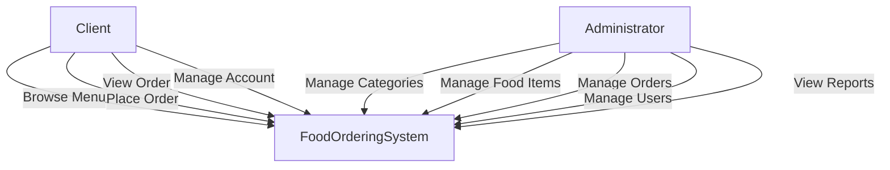
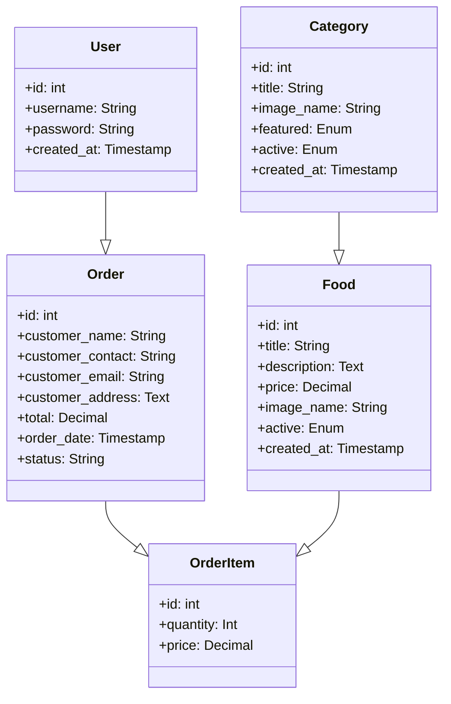
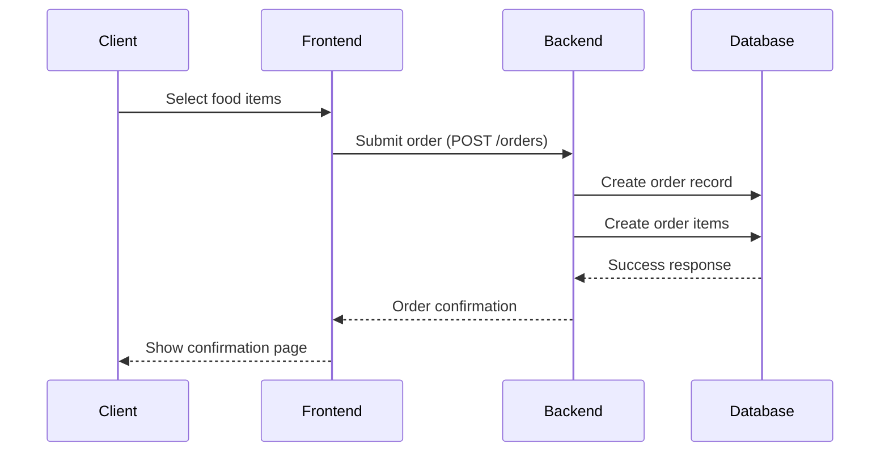
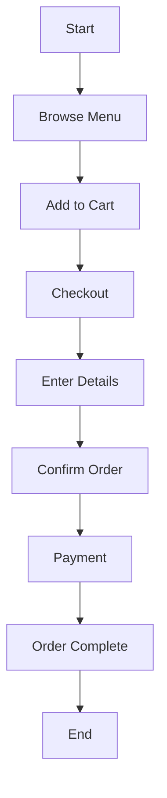
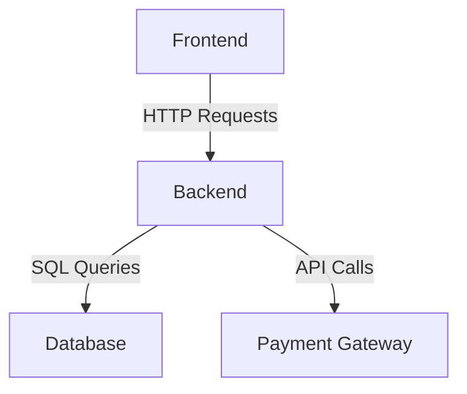
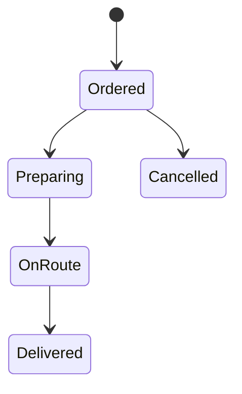

# UML Diagrams for Food Ordering System

## 1. Use Case Diagram
```

```

## 2. Class Diagram
```

```

## 3. Sequence Diagram (Order Process)
```

```

## 4. Activity Diagram (Order Flow)
```

```

## 5. Component Diagram
```

```

## 6. State Diagram (Order Status)
```

```

These UML diagrams provide a complete visual representation of your food ordering system, covering:

- **Functional Requirements** (Use Case Diagram)
- **Data Structure** (Class Diagram)
- **Process Flows** (Sequence & Activity Diagrams)
- **System Architecture** (Component Diagram)
- **State Management** (State Diagram)

You can generate these diagrams using [Mermaid.js](https://mermaid-js.github.io/).

