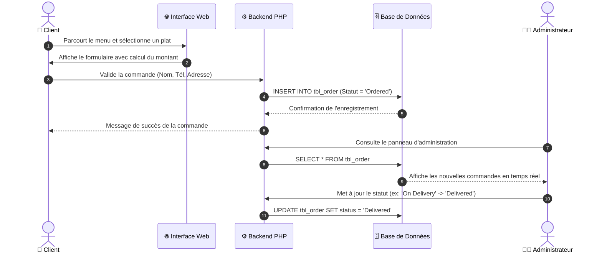
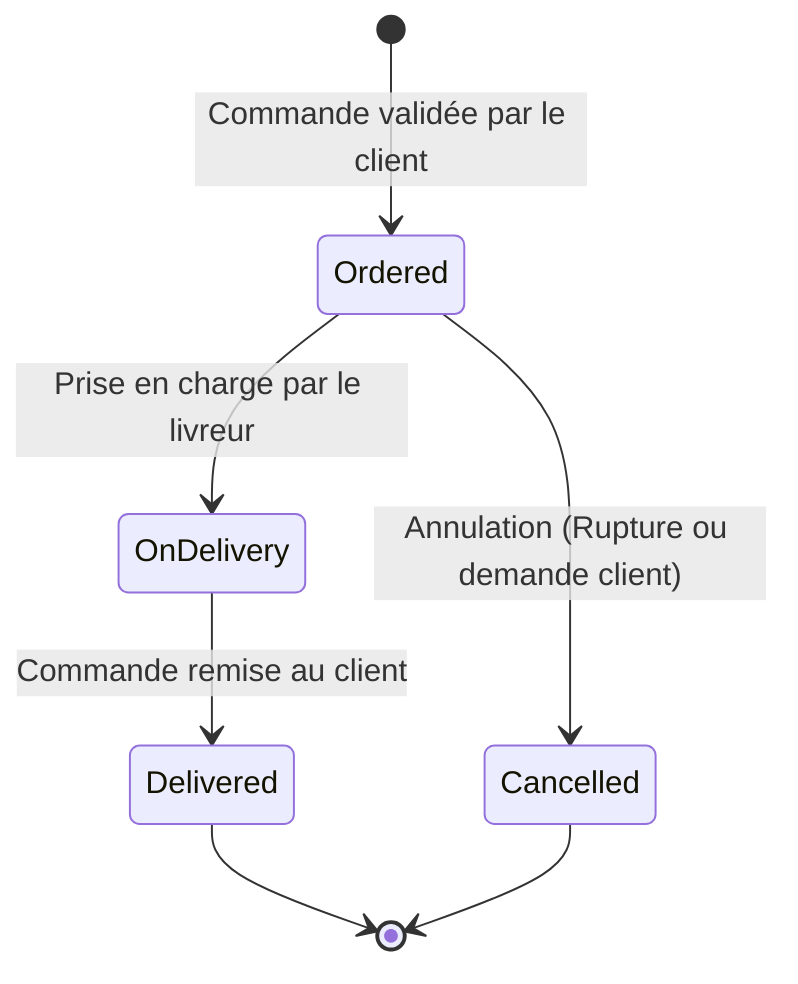

# 🍔 Food Order System - Plateforme de Commande et Gestion de Restaurant

[](https://www.php.net/)
[](https://www.mysql.com/)
[](https://www.apachefriends.org/)
[](https://developer.mozilla.org/fr/docs/Web/CSS)
[](LICENSE)

> Une solution web complète, dynamique et responsive conçue en **PHP & MySQL** pour la commande de repas en ligne et l'administration centralisée d'un restaurant.

---

## 📋 Sommaire

- [À Propos du Projet](#-à-propos-du-projet)
- [Fonctionnalités Principales](#-fonctionnalités-principales)
  - [Espace Client (Front-Office)](#-espace-client-front-office)
  - [Espace Administration (Back-Office)](#-espace-administration-back-office)
- [Architecture et Structure du Projet](#-architecture-et-structure-du-projet)
- [Base de Données et Modèle Relationnel](#-base-de-données-et-modèle-relationnel)
- [Processus et Diagrammes de Flux](#-processus-et-diagrammes-de-flux)
- [Installation et Configuration](#-installation-et-configuration)
  - [Prérequis](#prérequis)
  - [Guide Pas à Pas](#guide-pas-à-pas)
- [Comptes et Accès par Défaut](#-comptes-et-accès-par-défaut)
- [Sécurité et Bonnes Pratiques](#-sécurité-et-bonnes-pratiques)
- [Auteur et Contact](#-auteur-et-contact)

---

## 🍽️ À Propos du Projet

**Food Order System** est une application web conviviale permettant aux clients d'explorer un menu de restaurant varié (pizzas, burgers, spécialités asiatiques, etc.), d'effectuer des recherches rapides par mot-clé et de passer commande en toute simplicité.

Le projet intègre un **panneau d'administration sécurisé** offrant une maîtrise absolue sur les catégories, le catalogue des plats, le traitement en temps réel des commandes et la gestion des comptes administrateurs.

---

## ✨ Fonctionnalités Principales

### 🛒 Espace Client (Front-Office)

* **Page d'Accueil Dynamique** : Mise en valeur des catégories populaires et des plats vedettes (*Featured Foods*).
* **Moteur de Recherche Intégré** : Recherche instantanée de plats via formulaire dédié (`food-search.php`).
* **Navigation par Catégorie** : Filtrage intuitif des plats selon leur catégorie (`category-foods.php`).
* **Menu Complet des Plats** : Catalogue exhaustif affichant images, tarifs détaillés et descriptions appétissantes.
* **Passation de Commande en Temps Réel** :
  * Sélection dynamique des quantités avec calcul direct du total.
  * Formulaire client détaillé (Nom complet, Téléphone, E-mail, Adresse de livraison).
  * Enregistrement instantané avec statut initialisé à *« Ordered »*.
* **Interface Responsive** : Adaptation sur ordinateurs, tablettes et smartphones.

---

### 🛡️ Espace Administration (Back-Office)

* **Authentification Sécurisée** : Accès protégé par session avec hachage cryptographique des mots de passe.
* **Tableau de Bord Analytique** :
  * Chiffre d'affaires total généré (*Revenue Generated*).
  * Nombre total de commandes enregistrées.
  * Nombre de plats disponibles à la carte.
  * Nombre de catégories actives.
* **Gestion des Plats (CRUD Menu)** :
  * Ajout de nouveaux plats avec upload d'images, sélection de catégorie, prix et descriptions.
  * Modification et suppression sécurisée des éléments existants.
  * Options de mise en avant (*Featured*) et d'activation/désactivation (*Active*).
* **Gestion des Catégories** :
  * Création, modification et suppression de catégories avec visuels personnalisés.
* **Suivi et Traitement des Commandes** :
  * Liste détaillée des commandes reçues avec coordonnées clients.
  * Mise à jour du statut en temps réel :
    * 🟡 `Ordered` (Commandée)
    * 🔵 `On Delivery` (En cours de livraison)
    * 🟢 `Delivered` (Livrée avec succès)
    * 🔴 `Cancelled` (Annulée)
* **Gestion des Administrateurs** :
  * Ajout de nouveaux gestionnaires, modification d'identifiants et changement sécurisé de mot de passe.

---

## 🗂️ Architecture et Structure du Projet

```text
food-order/
│
├── admin/                         # Panneau d'administration (Back-Office)
│   ├── partials/                  # Composants réutilisables d'administration
│   │   ├── footer.php             # Pied de page admin
│   │   ├── login-check.php        # Vérification d'autorisation de session
│   │   └── menu.php               # Barre de navigation admin
│   ├── add-admin.php              # Création d'administrateurs
│   ├── add-category.php           # Création de catégories
│   ├── add-food.php               # Ajout de plats
│   ├── delete-admin.php           # Suppression d'administrateurs
│   ├── delete-category.php        # Suppression de catégories
│   ├── delete-food.php            # Suppression de plats
│   ├── index.php                  # Dashboard principal avec métriques
│   ├── login.php                  # Page de connexion administrateur
│   ├── logout.php                 # Déconnexion et destruction de session
│   ├── manage-admin.php           # Liste et gestion des administrateurs
│   ├── manage-category.php        # Liste et gestion des catégories
│   ├── manage-food.php            # Liste et gestion des plats
│   ├── manage-order.php           # Gestion et suivi des commandes
│   ├── update-admin.php           # Modification d'un administrateur
│   ├── update-category.php        # Modification d'une catégorie
│   ├── update-food.php            # Modification d'un plat
│   ├── update-order.php           # Modification du statut d'une commande
│   └── update-password.php        # Mise à jour du mot de passe admin
│
├── config/
│   └── constants.php              # Configuration de la base de données et constantes
│
├── css/
│   ├── admin.css                  # Feuilles de style pour le panneau d'administration
│   └── style.css                  # Feuilles de style pour le portail client
│
├── images/
│   ├── category/                  # Images téléversées des catégories
│   └── food/                      # Images téléversées des plats
│
├── partials-front/                # Composants réutilisables du portail client
│   ├── footer.php                 # Pied de page client et réseaux sociaux
│   └── menu.php                   # Barre de navigation principale
│
├── categories.php                 # Page de consultation de toutes les catégories
├── category-foods.php             # Filtrage des plats par catégorie spécifique
├── contact.php                    # Page de contact du restaurant
├── food-order.sql                 # Script SQL de création et initialisation de la BDD
├── food-search.php                # Résultats de recherche de plats
├── foods.php                      # Page listant l'ensemble des plats
├── index.php                      # Page d'accueil du restaurant
├── order.php                      # Page et formulaire de passation de commande
├── .gitignore                     # Fichiers et dossiers ignorés par Git
└── README.md                      # Documentation officielle du projet
```

---

## 🗄️ Base de Données et Modèle Relationnel

La base de données MySQL est structurée autour de 4 tables optimisées :

| Table | Description | Clés et Relations |
| :--- | :--- | :--- |
| **`tbl_admin`** | Stocke les comptes des administrateurs ayant accès au back-office | `id` (PK, Auto-Increment), `username`, `password` |
| **`tbl_category`** | Regroupe les familles de plats (Pizzas, Burgers, Momos...) | `id` (PK, Auto-Increment), `title`, `image_name`, `featured`, `active` |
| **`tbl_food`** | Contient le menu complet des plats proposés | `id` (PK), `category_id` (FK vers `tbl_category`), `price`, `featured`, `active` |
| **`tbl_order`** | Historique complet des commandes clients et statuts de livraison | `id` (PK), `food`, `price`, `qty`, `total`, `order_date`, `status`, `customer_*` |

---

## 🔄 Processus et Diagrammes de Flux

### 1. Cycle de Vie d'une Commande (Client & Restaurant)



### 2. Machine à États du Statut de Commande



---

## 🚀 Installation et Configuration

### Prérequis

* Un serveur web local type **[XAMPP](https://www.apachefriends.org/)**, **WampServer** ou **MAMP**.
* **PHP** (version 7.4 ou supérieure).
* **MySQL** / MariaDB.
* Un navigateur web moderne (Google Chrome, Firefox, Safari, Edge).

---

### Guide Pas à Pas

#### 1. Cloner ou Déplacer le Projet

Déposez le dossier du projet dans le répertoire racine de votre serveur local :
* **XAMPP** : `C:\xampp\htdocs\food-order\`
* **WAMP** : `C:\wamp64\www\food-order\`

```bash
# Exemple de clonage via Git
git clone https://github.com/votre-nom-utilisateur/food-order.git
```

#### 2. Démarrer les Services
Lancez le panneau de contrôle de **XAMPP** et démarrez :
* **Apache**
* **MySQL**

#### 3. Importer la Base de Données
1. Rendez-vous sur **phpMyAdmin** : [http://localhost/phpmyadmin](http://localhost/phpmyadmin).
2. Créez une nouvelle base de données nommée **`food-order`** avec l'interclassement `utf8mb4_general_ci`.
3. Cliquez sur l'onglet **Importer**.
4. Sélectionnez le fichier **`food-order.sql`** situé à la racine du projet, puis cliquez sur **Exécuter**.

#### 4. Vérifier la Configuration (`config/constants.php`)
Assurez-vous que les identifiants correspondent à votre environnement local dans `config/constants.php` :

```php
define('SITEURL', 'http://localhost/food-order/');
define('LOCALHOST', 'localhost');
define('DB_USERNAME', 'root');
define('DB_PASSWORD', '');
define('DB_NAME', 'food-order');
```

#### 5. Accéder à l'Application
* 🛍️ **Portail Client** : [http://localhost/food-order/](http://localhost/food-order/)
* 🔐 **Portail Administration** : [http://localhost/food-order/admin/](http://localhost/food-order/admin/)

---

## 🔑 Comptes et Accès par Défaut

Lors de l'importation initiale de `food-order.sql`, un compte administrateur est configuré par défaut :

| Rôle | URL de Connexion | Nom d'utilisateur | Mot de passe |
| :--- | :--- | :--- | :--- |
| **Administrateur** | `/admin/login.php` | `admin` | `admin` |

> 🔒 *Il est vivement conseillé de modifier ce mot de passe dès la première connexion via le menu "Changer de mot de passe".*

---

## 🛡️ Sécurité et Bonnes Pratiques

* **Protection des routes d'administration** via le contrôle de session obligatoire (`login-check.php`).
* **Hachage des mots de passe** pour les comptes administrateurs.
* **Séparation modulaire** du code (partials, configuration, feuilles de style dédiées).
* **Validation des formulaires** côté client et traitement côté serveur.

---

## 👩‍💻 Auteur et Licence

* **Développeuse** : [fatimzahraetijani](https://github.com/fatimzahraetijani)
* **Licence** : Ce projet est sous licence open-source [MIT](LICENSE).
